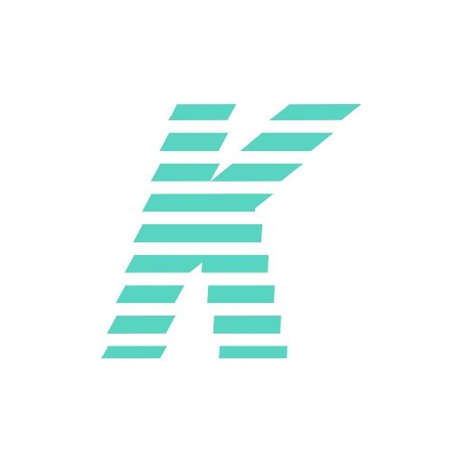

<h1>🤳 KSP</h1>

KSP is an open-source school website infrastructure made for training purposes only. This repository is currently open for contributions (issues and pull requests).

<h2>🎲 Development</h2>

This repository/project is currently **WIP (Work In Progress)**, as said above and below, your help is always welcome. 

This is not a important project, I made it for fun and training purposes, so this is not my focus and it can seem to be "abandoned", but it's not, it's just not my focus at the moment.

<h2>🚄 Roadmap</h2>

The current roadmap for this repository can be found on [this issue](https://github.com/SrGaabriel/ksp).

We would love if you could help us improving and helping the production of the items marked as non-ready or non-finished.

<h2>🧾 License</h2>

This repository is currently under the [MIT License](https://github.com/SrGaabriel/ksp/blob/master/LICENSE).